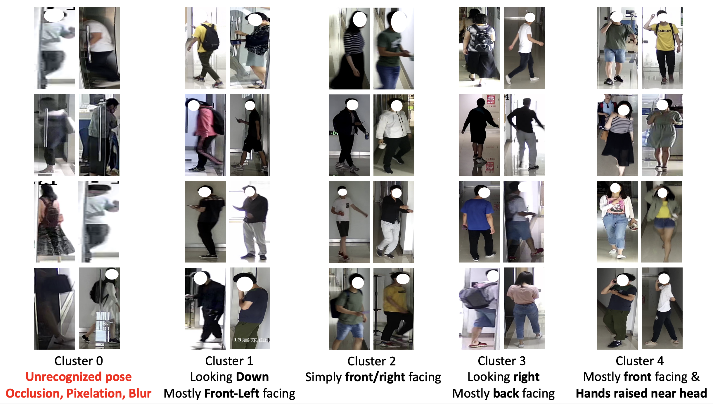

# RLQ-CGAL-UBD
Implementation of **Coarse-grained Attribute Learning with Unsupervised Distillation for Real-World Clothes Changing ReID** [Arxiv]() 
 
### Table of Contents 
* **[Cite](#citation)**<br>  
* **[Setup](setup.md)**<br>
* **[ALL Pretrained weights](https://github.com/ppriyank/RLQ-CGAL-UBD/releases/tag/Pre-trainedWeights)** <br>
  * Inference & training RLQ (Celeb ReID weights) 
  * Logs with pretrained weights will provide configuration details like Batch Size, Seed, etc. 
* **[Inference](#inference)**<br>  
* **[Results](#results)**<br>  
* **[Training](#training)**<br>  
* **[Visualization](#visualization)**<br>  


## Inference 

[Analysis](Scripts/analysis.sh) has scripts for various evaluations.
Mainly RLQ can be evaluated, on datasets like `ltcc_cc_gender`, `prcc_cc_gender`, `last_cc_gender`. Code is dataset independent, just replace dataset argument to do desired inference.
```
NUM_GPU=2
GPUS=0,1
checkpoint='logs/ltcc_cc_gender/R_LA_15_B=32_1/best_model.pth.tar'
CUDA_VISIBLE_DEVICES=$GPUS python -W ignore -m torch.distributed.launch --nproc_per_node=$NUM_GPU \
  --master_port 12345 main.py --cfg configs/res50_cels_cal_tri_16x4.yaml --dataset ltcc_cc_gender \
  --gpu $GPUS --output ./ --root $ltcc --image --class_2=16 --Pose=$ltcc_pose --pose-mode="R_LA_15" \ --overlap_2=-3 --use_gender $ltcc_gender --extra_class_embed 4096 --extra_class_no 2 --gender_id \
  --backbone="resnet50_joint3_3" --tag output --resume $checkpoint --eval --no-classifier
```


## Results 

Results mentioned here are somewhat higher than whats reported in paper. Paper is actually an average of best two runs. Here are providing weights of the best run. 

| RLQ             | Top 1 (CC) | mAP (CC) | Wts & Log |
|-----------------|-------|------|-----------|
| Celeb ReID Base Model |  58.1 | 14.2 | [Link](https://github.com/ppriyank/RLQ-CGAL-UBD/releases/download/Pre-trainedWeights/celeb.zip) | 
| Celeb ReID Base Model + CGAL    |  59.2 | 14.9 | [Link](https://github.com/ppriyank/RLQ-CGAL-UBD/releases/download/Pre-trainedWeights/celeb_cc_colors.zip) | 
| | | | |
| LTCC (Using CelebReID Base Model)  |  46.4 | 21.5 / 21.9 | [Wt1](https://github.com/ppriyank/RLQ-CGAL-UBD/releases/download/Pre-trainedWeights/R_LA_15_B.32_1.zip) / [Wt2](https://github.com/ppriyank/RLQ-CGAL-UBD/releases/tag/Pre-trainedWeights#:~:text=5%20days%20ago-,RLQ_15_B.32_4.zip,-301%20MB) | 
| LTCC (Using CelebReID Base Model + CGAL)  |  46.7 | 22.0 | [Link](https://github.com/ppriyank/RLQ-CGAL-UBD/releases/tag/Pre-trainedWeights#:~:text=R_LA_15_DS_NC_B.40_2_2.zip) | 
| LTCC (Using CelebReID Base Model) + 25 Pose Clusters (instead of 15) |  46.7 | 21.7 | [Link](https://github.com/ppriyank/RLQ-CGAL-UBD/releases/download/Pre-trainedWeights/RLQ_25_B.32_1.zip) | 
| | | | |
| PRCC (Using CelebReID Base Model)  | 65.1 | 63.8 | [Link](https://github.com/ppriyank/RLQ-CGAL-UBD/releases/download/Pre-trainedWeights/R_LA_15_B.32_1.zip) | 
| | | | |
| LaST (Using CelebReID Base Model)  (4 GPUs) | 77.9 | 35.3 | [Link](https://drive.google.com/file/d/1whiANkxRW9lo4HhpHZYminjVkviOE6_D/view?usp=sharing) | 
| | | | |
| DeepChange (Using CelebReID + Base Model) (6 GPUs) | 59.2 | 22.5 | [Link](https://github.com/ppriyank/RLQ-CGAL-UBD/releases/download/Pre-trainedWeights/deepchange_cc_gender.zip) | 
| | | | |


## Training  

Place Celeb ReID weights in `logs/` folder. Update the `Celeb_Wt_KL` and `R_LA_15_2_ABS_GID` in scripts such that : 
 ```
Celeb_Wt_KL=logs/celeb/B=40_KL_4/checkpoint_ep200.pth.tar
R_LA_15_2_ABS_GID=logs/celeb_cc_colors/R_LA_15_2_ABS_GID/best_model.pth.tar
```

Seeds intialization and Batch size is important. Performance changes a lot across seeds. Thus we recommend running experiments with 1,2,3,4 and reporting an average of best two runs. 

Please check [Scripts](Scripts/) for running various models.  We have provided Scripts like : 
[Vanilla CAL model](Scripts/run_CAL.sh), [Base Model](Scripts/run_basemodel.sh), [Gender Only](Scripts/run_gender.sh), [Pose Only](Scripts/run_Pose.sh), [RQL Model](Scripts/run_final.sh). 

Most ablation reported in paper is an average of two runs, done on batch size 28 for LTCC and 32 & 40 for PRCC. Best performance for RQL model for LaST, DeepChange is with Batch size 40, and LTCC is on Batch size 40 & 32, and 32 for PRCC.

Code is dataset independent, just replace dataset argument to do desired training.

### Pre Processing (Train Only)
All Pose Clusters and Gender related Information for each dataset is kept in [Scripts/Helper](Scripts/Helper). This folder also has a list of all RGB images where silhouttes are faulty, and size csv to get a size buckets images fall in.  

  - (**Provided**) Genders were manullay generated. (1-> Male / 0 -> female )  
  - (**Provided**) Size is measure of spatial resolution. 
  - (**Needed**) Silhouttes were generated by [Self-Correction for Human Parsing](https://github.com/GoGoDuck912/Self-Correction-Human-Parsinghttps://github.com/GoGoDuck912/Self-Correction-Human-Parsing) with pretrained weights (`checkpoints/exp-schp-201908261155-lip.pth`). The script should generate npy dumps.
    - [Prep Mask](Scripts/Processing/prep_mask.py) will convert npys to requiste masks (pants and tops) 
  - (**Provided**) [Alpha Pose](https://github.com/MVIG-SJTU/AlphaPose) is used to dump 2D skeleton. Config: `configs/coco/resnet/256x192_res50_lr1e-3_1x.yaml` , Model Wt: `pretrained_models/fast_res50_256x192.pth`  
    - Pose clusters are generated via [Prep Pose](Scripts/Processing/prep_pose.py)  with cluster size of 5,10,15,20,15,25,30,35,40 : 

| **Pose Vector** |                               **Description**                               |
|-----------------|-----------------------------------------------------------------------------|
| R_LA            | Poses vectors is length and angle of Body lines (Selected for final model)  |
| R_LAC           | Poses vectors is length and angle of Body lines + Coordinates of joints     |
| R_A             | Poses vectors is only angle of Body lines (Selected for final model)        |
| N_LA            | R_LA w/o resizing from 2d skeleton model output (code needs to be modified) |
| N_LAC           | R_LAC w/o resizing from 2d skeleton model output (code needs to be modified)|
| N_A             | R_A  w/o resizing from 2d skeleton model output (code needs to be modified) |


### Visualization 

#### Pose Clusters (Train Only)




#### Synthetic LQ images (Train Only)


#### UBD (Train Only)


# Citation
If you like our work, please consider citing us: 

```
@article{,
  title={Coarse-grained Attribute Learning with Unsupervised Distillation for Real-World Clothes Changing ReID},
  author={Pathak, Priyank and Rawat, Yogesh S},
  journal={ArXiv},
  year={2024},
  volume={ }
}
```
